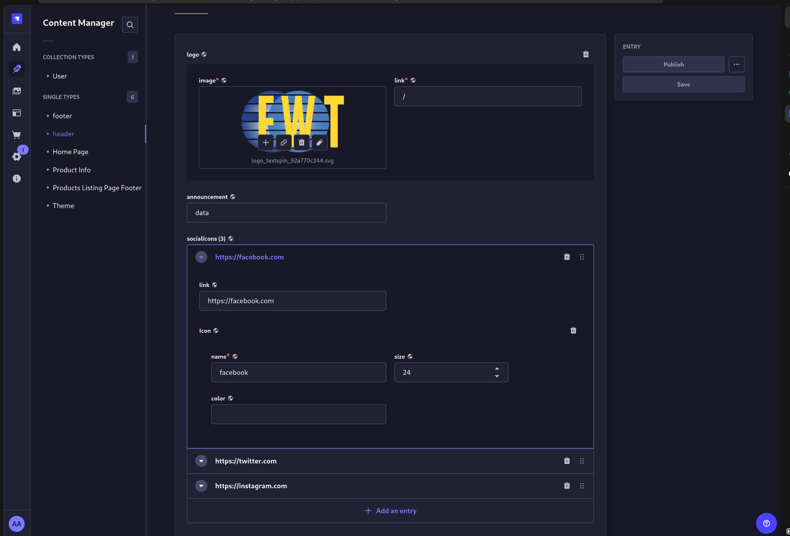
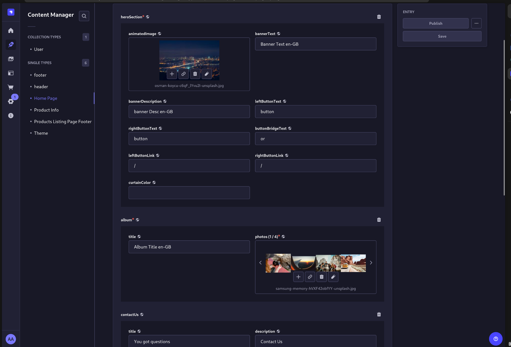
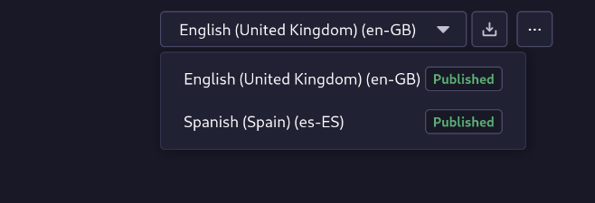

# Kullanıcı Dokümantasyonu

Bu dokümantasyon, EWT sisteminin temel bileşenlerini ve sorumluluklarını açıklamaktadır. Sistem temel olarak iki ana bileşenden oluşmaktadır: Strapi ve Shopware. Strapi, ürünlerden bağımsız içerik yönetiminden sorumluyken, Shopware ürün yönetimi, kullanıcı yönetimi ve site yönlendirmelerinden sorumludur.

## Sistem Bileşenleri

### Strapi

- İçerik yönetimi
- Blog yazıları
- Statik sayfalar
- Medya yönetimi

### Shopware

- Ürün kataloğu yönetimi
- Kullanıcı hesapları
- Sipariş yönetimi
- Site navigasyonu

## Örnek Ekran Görüntüleri

### Ana Sayfa Görünümü

{loading=lazy}

### Strapi Yönetim Paneli

 - {loading=lazy}
 - {loading=lazy}

## Temel Bilgiler

### Çoklu Dil Desteği (i18n)

Sistem, hem Shopware hem de Strapi üzerinde aşağıdaki dil seçeneklerini desteklemektedir:

- İngilizce (EN-GB)
- İspanyolca (ES-ES)

İlgili içerikler, Strapi üzerinde dil seçeneği belirlenerek yayınlanabilir.

**Not**: Strapi üzerinde içerik düzenlemesi yaparken yalnızca **Content Manager** bölümüyle ilgilenmeniz yeterlidir. Strapi üzerinde çoğu yetkinin kısıtlanmış olması normal bir durumdur ve varsayılan bir güvenlik önlemidir. Örneğin yeni bir içerik türü oluşturmak canlıda tamamen kapalıdır. İçeriklerde yapılan bir değişikliğin özellikle stable bir yayında anında yansımaması doğaldır. İçerikler cache'e zorlanmış olabilir.

**Planned**: Strapi veya Shopware'e erişim ileride VPN ile kısıtlanabilir. Ekstra bir güvenlik getirirken sisteme erişim sistem VPN'i üzerinden olmak zorunda kalabilir/kalacaktır.
